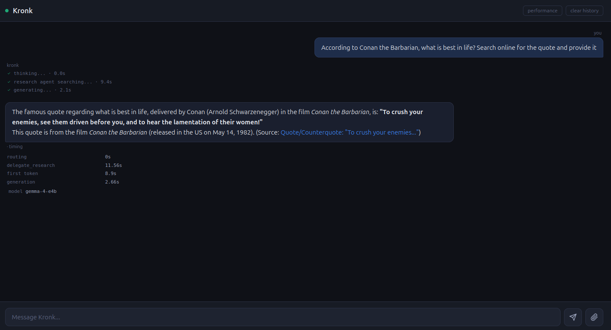

## Problem

We want to build an AI server, complete with AI pipeline, to run inside our home on dedicated hardware.

Specific goals include:

* Sufficient memory to run multiple models (for benchmarking, for managing specialist agents, etc).
* Not take up tons of space in the home.
* be as quiet as possible.


## Solution

[Framework's gaming desktop](https://frame.work/products/desktop-diy-amd-aimax300/configuration/new) fits this beautifully. As of this writing, the desktop maxes out at 128GB of unified memory. The "unified" is important because that means the system shares memory with the GPU, which checks our "tons of headroom for models" need. And the _size_! It's so small! I can literally hide it next to some random A/V gear and no one even notices it. It's also dead silent when idle, and I have yet to hear the fans while it's working hard for me. I'm in love.

### A Word on Technology

Overwhelmingly, the heavy lifting on the entire Kronk project is done by Claude Code. After installing the latest Ubuntu, I SSH into the machine, stand up a tmux session, and start a Claude Code session with remote-control enabled. This lets me work while in my house, brainstorm and plan (and execute) while on the go via the Claude mobile app, and impress my friends by showing said sessions. This is what I mean when I say [move up one level]().

Also, yes, I'm running Claude Code in yolo mode. If I don't do this, I have to approve too many commands, work slows, and what is supposed to be a joyful project turns into a chore. However, I have several compensating controls:

* No `sudo`. If Claude needs me to `sudo make-a-sandwich`, it has to raise its hand and ask.
* Runs under my normal user - this has the knock-on effect of being unable to modify system files due to permissions.
* Disposable machine. I love this Framework desktop, but I can build it again with no real loss since everything is version controlled.
* Speaking of version control, Claude 1) has instructions to NOT run any `git (add|commit)` commands, and `git push` is gated by an SSH key that requires me to hand-type the passphrase. So no automatic code pushes (giving me a chance to inspect the repo for any sensitive information).
* Outside of systems that power Kronk, there are no credentials. No Google keys, no passwords to external systems. Nothing. 

This is not a perfect solution. There's still risk (Claude once ran a port scan on my home network because it was trying to find a monitoring appliance), but as they say, the perfectly secure machine is one that's powered off and buried six feet underground. Even then, you can get creative.

### Unlocking All That Memory

Unfortunately, the default behavior is to only allow 50% of that memory to be given to the GPU.

The fix, [documented here in the README](https://github.com/drawsmcgraw/kronk/tree/8661a96dc65b8bd46f3001e116ac372770330327#gpu-memory-gtt-ceiling), is to pass a boot config in Grub to tell the system to increase that ceiling. According to other posts on the Internet, you don't want to give the _full_ 128GB over to the GPU because, well, you still have a system to run. The sweet spot seems to be around 101GB. So we add the following to `/etc/default/grub'.

```
GRUB_CMDLINE_LINUX_DEFAULT="quiet splash ttm.pages_limit=26624000 ttm.page_pool_size=26624000"
```

A reboot later, and we have all that memory unlocked. Confirmed with:

```
awk '{printf "%.1f GB\n",$1/1024/1024/1024}' /sys/class/drm/card1/device/mem_info_gtt_total
101.6 GB
```

### Choosing the Inference Engine

For simple use cases, llama.cpp works perfectly. The problem though, is that this is an AMD chipset, not Nvidia (thus, no CUDA), so (as of this writing), the pre-built binaries that will work for the ROCm architecture (AMD's version of CUDA) don't support the GPU on this Framework desktop. No problem, build from source. Unfortunately, this requires a set of dev tools, not all of which are packaged for the latest Ubuntu yet. That's okay - we can build it inside a container, then extract the build binaries (Claude's idea, by the way). Documented [here](https://github.com/drawsmcgraw/kronk/tree/8661a96dc65b8bd46f3001e116ac372770330327#building-llamacpp-for-gfx1151) but also below:

```
# using the rocm/dev-ubuntu-24.04:7.2-complete container image, build with:
cmake -B build -DGGML_HIP=ON -DAMDGPU_TARGETS="gfx1151" \
  -DGGML_HIP_NO_VMM=ON -DBUILD_SHARED_LIBS=ON
cmake --build build --config Release -j$(nproc) --target llama-server
```

And done! We now have a compatible llama.cpp server.

### Running Models as a Normal User

Systemd gives us the ability to start/stop/manage services at the user level. Just drop a file into `~/.config/systemd/$USER/llama-service-name` and you're off! This gives Claude the ability to stop/start/restart models with different configs without needing me.

### Service Oriented Architecture, but Tiny

Just about every service in Kronk runs as a container, so we'll stuff everything into Docker Compose (see [here](https://github.com/drawsmcgraw/kronk/blob/8661a96dc65b8bd46f3001e116ac372770330327/docker-compose.yml)) and services will reference each other over the container network (see `networks.kronk.driver: bridge` in the `docker-compose.yml`). The notable exception to this is the various llama.cpp services, mostly because we're already lucky to get compiled support for this GPU and there's no benefit to inroducing the complexities of GPU passthrough for containers.

### Building the First Interface

The obvious first draft of Kronk is a chat interface so that's what we did. I simply asked Claude to build one, using some tasteful color schemes. I also wanted some timing information and details about how the prompt was routed (i.e. tool calls, which model answered, etc). The details of that are for a future post. The result is the below.



### Next Steps

There's so much to do here, but one of the main reasons I wanted all that headroom was to run multiple models at once to support a sort of 'specialist' AI pipeline. More on that in the next post.
