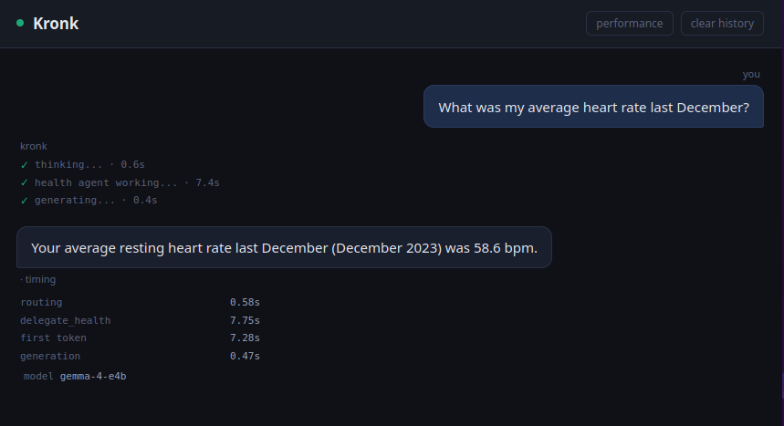
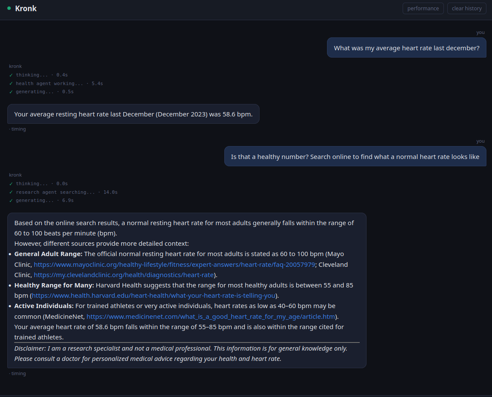

## Problem

We have a simple chat UI up, but it's just a glorified call-and-response. We need to expand the capbilities beyond just interrogating a model. We want things like querying our health data, running online research, and other ways of interacting with the world. In a word, we need to upgrade our AI pipeline to be agentic.

NOTE: This is Part 2 in my Kronk AI server series. For part 1, see [here]().

## Solution

Build agents.

Before we move on, let's estalblish what an 'agent' is right now. There are many definitions and most of them, while well-intended, are misleading. In my experience, an agent is any combination of an AI model + one-or-more tools to allow said model to interact with the outiside world. We're going with that definition here.

How do we do it with Kronk? Thankfully, Kronk has sufficient resources to run multiple models (or instances of the same model) at once, so we have some room for flexiblity here. We want the user experience untouched (that is, we still want a simple chat interface), we just want the machine to make the decision about what agent is responsible for what action.

So how do we make that decision? The simplest pattern I found was to use a Routing Agent - this agent's only job is to input the prompt from the user (plus all previous conversation) and make a decision on where to, well, route that request. Because the task is pretty limited in scope, we don't need a huge, capable model. At first, I tried [Bonsai](https://prismml.com/news/bonsai-8b) because it's ultra-small. The response was, indeed, very fast. However, Bonsai seems made more for industrial situations or similar environments. I kept getting incorrect routing or, sometimes, just outright wrong responses (instead of being routed). After some more experimenting, I landed on Gemma-3. It's not the latest and newest, but it was the best compromise of speed & capability (reminder that, the larger a model is, the smarter it is, BUT the slower it gets).

So the Orchestrator service picks up the prompt from the user and hands it to the Router (Gemma-3 and/or Mistral-nemo at the moment). You can see the exact line where this is called [here in `orchestrator.py`](https://github.com/drawsmcgraw/kronk/blob/c5761a8043a3d7cfc8e55d3c0bf8576913a153be/orchestrator/main.py#L203). What comes back from that call dictates which model services the next stage in the pipeline. 

From here is where we talk about "agents". In the subsequent call in the pipeline, we're making tools available, but not all tools are available to all agents. The reason for this is complexity. More tools means more complexity, and more complexity drives down model accuracy and drives up execution time. So for every stage in the pipeline, we need to reduce that complexity.

As an example, the Research agent only has the [`search`](https://github.com/drawsmcgraw/kronk/blob/c5761a8043a3d7cfc8e55d3c0bf8576913a153be/tool_service/main.py#L174) tool. Only the Health agent is given the [`health`](https://github.com/drawsmcgraw/kronk/blob/c5761a8043a3d7cfc8e55d3c0bf8576913a153be/orchestrator/tools.py#L460) tool, and so on.

For more gorey details, [here](https://github.com/drawsmcgraw/kronk/blob/c5761a8043a3d7cfc8e55d3c0bf8576913a153be/orchestrator/agents.py#L45) is where the mapping of "agent":"model" (i.e. the health agent should be run by Gemma) is made and [here](https://github.com/drawsmcgraw/kronk/blob/c5761a8043a3d7cfc8e55d3c0bf8576913a153be/orchestrator/agents.py#L79) is the section where all of the available agents are declared. This is the list of agents made available to the Router agent when it's called.

Worth noting that the Routing agent "cheats" a little and uses some keywords to immediately kick a request over to a specific agent. Words like "search online", for example, will hit a regex pattern and immediately call the research agent. A user prompt that includes "ask Talkie" automatically hands the prompt to [Talkie](https://talkie-lm.com/introducing-talkie). This saves us a model call and, thus, time. Less accuracy? Possibly, but worth it in the majority of use cases. That regex search begins [here](https://github.com/drawsmcgraw/kronk/blob/c5761a8043a3d7cfc8e55d3c0bf8576913a153be/orchestrator/routing.py#L22).

Once the appropriate agent picks up the work, another call is made, and the loop begins. Currently, agents are allowed to cycle through three "loops" of calls (e.g. if the research agent needs to run multiple searches & iterations), at which point the hard cap is reached and the respone is given back to the orchestrator. Finally, the orchestrator receives the response from the agent, reads it, and then synthesizes what it sees, generating the final output that's handed back to the user. 

As a reminder, the tools run in their own containers, all living on the same container network. So they all appear as services reachable over a REST interface, which neatly mimics something you'd deploy at scale (i.e. beyond a single desktop living under your home stereo in the living room).

A rough diagram of what this looks like is below.



And you can see which agent responded (as well as which model powered it) thanks to some telemetry added by the Orchestrator.

Seven seconds to query historical heart rate. Not bad, in my opinion. And the great thing is, because it retains history, I can ask it to search online if that's normal or something to be concerned about.

And it all stays in the house. The only time packets left the home was during the research phase where Kronk searched online. Building the health data is a topic for another post but for now, it's a simple SQL database that I manually update by handing Kronk a download of my smartwatch health data.

I'm not convinced this is the best pattern but it's the one that works for now. I tried collapsing all of the 'agents' to just one large, smart model with all tools available and the accuracy plummetted, proving the theory that "more tools means more complexity which means worse experience". As with any nontrivial system, it's better to stick to the Unix philosophy of "Do one thing and do it well", even with something as seemingly omniscient as an AI model that can query your health or tell you the weather. 

What are we not doing? A lot. There's no auth. The current pipeline only handles one concurrent user. There's a global chat history. All manner of "grown up" features aren't being implemented. This will be important when we introduce voice control to the system, because it adds a client. Right now, we only have the chat UI. Introducing a voice command adds a second client without any context. At best, this crosses some wires. At worst, it's an outright failure if two interactions hit Kronk at the same time. We'll talk about voice control in the next post.