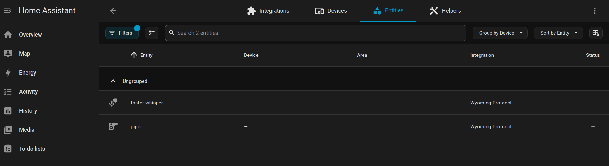
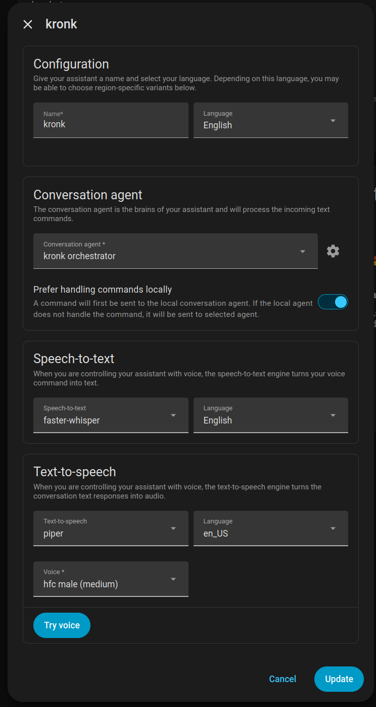

## Problem

We have an agentic workflow that can perform useful tasks like weather lookup & research but it's constrained to a web UI. Useful systems have multiple entry points. We want to introduce voice control to our system.

NOTE: This is Part 3 in my Kronk AI server series. For part 2, see [here]().

## Solution

Add a voice input device as a client to the system.

### Background

When we built Kronk, we deliberately built the chat UI to be just another client. That used to be a `/messages` entrypoint and, under simple conditions, we could just use that entrypoint. However, for reasons we'll get into, we needed to provide an Ollama-compatible shim to support an entrypoint into the pipeline. That meant putting a thin layer in front of the pipeline, so the entrypoint for _all_ clients is now [`_run_pipeline](https://github.com/drawsmcgraw/kronk/blob/3f7fcb89b07fa9c8cf9c91b51018f657476d2d5a/orchestrator/main.py#L238). Let's get into why we made these choices.

### Hardware

It turns out that building a hardware device, writing the firmware, and training it to recognize wake words is a lot of work. Fortunately, the Home Assistant community has been hard at work on this and you can easily purchase a [Home Assistant Voice Preveiw Edition](https://www.home-assistant.io/voice-pe/). This does, mean, howeever, that we need to bring Voice Assistant into the tech stack. Not hard. This is why we put Kronk on our Framework desktop with lots of memory, so we could easily run these supporting services. 

### Introducing Home Assistant

[One docker-compose file](https://github.com/drawsmcgraw/kronk/blob/d2569a8919c5763cdce5614d6c39235d65a5f1ac/docker-compose.ha.yml), configure `restart: unless-stopped`, and Home Assistant (HA) starts on boot and is always ready. Now, for the voice part.

The voice support for HA is meant for HA - it's meant for tasks like `Okay Nabu, turn off the kitchen lights` or `Okay Nabu, I'm home`. Things like `Okay Nabu, what was my average heart rate last month` take a little more work. Instead of recreating perfectly good docs, I'll refer you to [Home Assistant's page in the docs on how to run a fully local, self-hosted LLM powered, voice assistant](https://www.home-assistant.io/voice_control/voice_remote_local_assistant/). This means you can use Home Assistant to _coordinate_ the entire voice pipeline, using your own LLM as the brains! However, there's a snag with the voice-to-text part.

### Speech to Text (STT)

The HA docs tell you to browse the app marketplace and install the Whisper addon for voice-to-text. But that's only available in HAOS, and you don't get that when you're running HA in a container. So we're going to have to run it ourselves. We went with [faster-whisper](https://github.com/SYSTRAN/faster-whisper) as the server and put the `large-v3-turbo` model in it. HA supports this case, but it only supports Ollama backends and CTranslate2 (what faster-whisper runs on) is not Ollama. Thanks to a clever Claude, we were able to write [a shim to make it appear like an Ollama service](https://github.com/drawsmcgraw/kronk/blob/3f7fcb89b07fa9c8cf9c91b51018f657476d2d5a/orchestrator/main.py#L723), so we can now add it as a backend for TTS in HA.

### Pipeline Work

From here, it's exactly the same as if I typed something into the chat UI. But once the final response is generated, we now need to take that text and turn it into speech...

### Text to Speech (TTS)

For the return trip, we went with [Piper TTS](https://github.com/drawsmcgraw/kronk/blob/3f7fcb89b07fa9c8cf9c91b51018f657476d2d5a/docker-compose.yml#L179) in a container and configured it accordingly in Home Assistant. From there, HA handles sending the voice back to the device that initiated the whole trip.

### All In One View

In HA, the two endpoints appear like this under Wyoming Protocol entities:

And put together, the 'Kronk Voice Assistant' in Home Assistant looks like this. You can see the `faster-whisper` and `piper` entries from the previous image in the "Speech-to-text" and "Text-to-speech" sections, respectively.

That `faster-whisper` entry is running directly on the host (because GPU access) but the `piper` entry is just Piper running in a later version of the container image (apparently generating voice from text is a lot less effort).

A note on the `Prefer handling commands locally` toggle switch. This is switched on because I still want HA to make an attempt at matching my voice prompt to a command. Mostly this is limited to creating timers (one of the things on my list to draw down our dependency on ~the Facless Lady~ the Amazon Echo ecosystem).

### Next Steps

I can now converse with Kronk! He doesn't sound like Kronk yet. He sounds like a disinterested robot. But voice customization will come later. Also, thanks to a per-client history manager, I can hold a conversation and give follow up prompts with the speaker. If I need to clear the history, I just say `clear my history` and Kronk will delete the conversation history and start from scratch. Great for when you hit a rut in the conversation.

Now that I can interact with Kronk via voice, a lot of capabilities are unlocked (provided we write them, that is). I recently finished the ability to ask Kronk to `update the magic-mirror`. That goes into some decisions on creating agentic systems and is the subject of the next post. 
