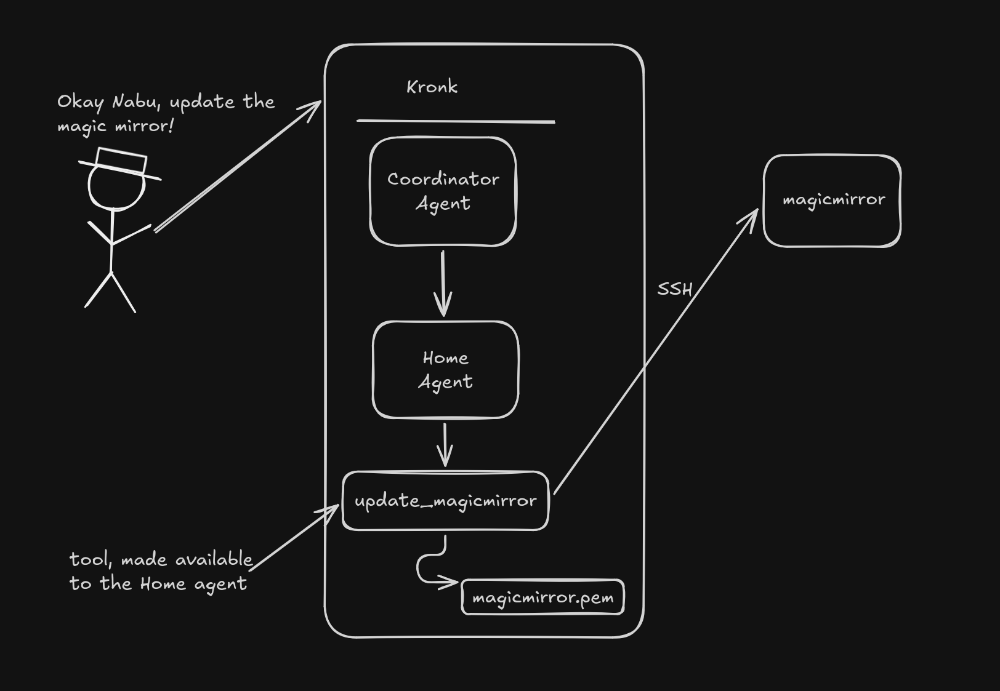

## Problem

We have our AI server. It can answer silly questions by researching the Internet (recipes!) but we need it to actually do some work. We need a different kind of agent. One that can effect some change.

We also have a [MagicMirror](https://magicmirror.builders/) that needs updating sometimes. But we hate manually SSH'ing in, making backups, and waiting ten minutes while an `npm build` grinds on a Raspberry Pi.

I love taking two problems and turning them into one solution.

NOTE: This is Part 4 in my Kronk AI server series. For part 3, see [here]().

## Solution

Tightly scope the permissions of the agent and give it specific tasks while still allowing it the freedom to interpret results.

The journey begins with "Okay Nabu, update the magic mirror". The coordinator agent decides which (if any) agent to route the request to. Because this is a highly specific ask, we just added this to [our regex short-circuit list](https://github.com/drawsmcgraw/kronk/blob/756391a36d4d250d79c7c07ebe9e8900f6996ba3/orchestrator/routing.py#L103), which then tells the coordinator that [this belongs to the home agent](https://github.com/drawsmcgraw/kronk/blob/756391a36d4d250d79c7c07ebe9e8900f6996ba3/orchestrator/routing.py#L183).

That results in the [update_magicmirror](https://github.com/drawsmcgraw/kronk/blob/756391a36d4d250d79c7c07ebe9e8900f6996ba3/orchestrator/tools.py#L960) tool being called. This sends an acknowledgement back up the pipe to the user to let them know that this is going to take a minute but we're going to get to work right away. The tool uses an SSH key (assigned just to the `pi` user on the magicmirror) to scp the [mm-update.sh](https://github.com/drawsmcgraw/kronk/blob/756391a36d4d250d79c7c07ebe9e8900f6996ba3/magicmirror/mm-update.sh) script, which has a few options. Short version, it runs a preflight check ("did we succeed in scp'ing the script? Can we successfully run it?"), then runs it once more to make a backup of the entire `magicmirror` directory, then update 1) the main magicmirror component and 2) every module inside. If a module has custom code, said module is skipped (rule #8, first do no harm). 

After performing the update, the magicmirror process is restarted, the status is checked (the magicmirror runs as a systemd service so it's easy to confirm liveness), and the tool returns. At this point, the status is handed to [_mm_update_speech()](https://github.com/drawsmcgraw/kronk/blob/756391a36d4d250d79c7c07ebe9e8900f6996ba3/tool_service/main.py#L726), which crafts the return message (success or failure?), and then [_ha_announce()](https://github.com/drawsmcgraw/kronk/blob/756391a36d4d250d79c7c07ebe9e8900f6996ba3/tool_service/main.py#L711) uses the 'announce' feature of Home Assistant to broadcast the end result. The call targets the original voice device so it announces it only on that one device instead of blowing up the whole house with an update message.

Put together, the whole thing looks (roughly) like the following.

Some notes on the entire solution:

* When you're creating agents, smaller is better. Fewer tools, fewer permissions, not all of the context. Kronk has _many_ tools available but the Home agent only has a few. This reduces confusion, increases response time, and increases the chances that you get the desired response.
* As mentioned in [Part 1](), limit what the agent can do. Yes, we have an SSH key. It's scoped to a single user on a single host. Proper separation of concerns would go one step further and remove `sudo` rights from that user. I didn't do that here because 1) the blast radius is small and 2) it's not worth the separation and confusion, especially since the magicmirror was already in place.  
* The `update_magicmirror` tool is what I'm learning is called a "terminal tool" (at least that's what Claude calls it). I was confused at first because I was thinking Bash. It's not. It's 'terminal' as in "Final Destination". The Coordinator has the ability to, well, coordinate multiple calls among multiple agents, but updating the magicmirror is a pretty deterministic path So the tool for doing that is labelled as a "terminal" tool, meaning this is the end of the loop. No more calls to other agents or tools. This is another way we can 1) make the action more deterministic and 2) shorten the response time.

This one was especially fun because it has a direct impact on my day-to-day. My goal with any interactions with AI are 1) have fun but 2) make my life better. Getting a machine to do the things I'd rather not has always been a theme in my career and I think this makes a great addition to the story.
